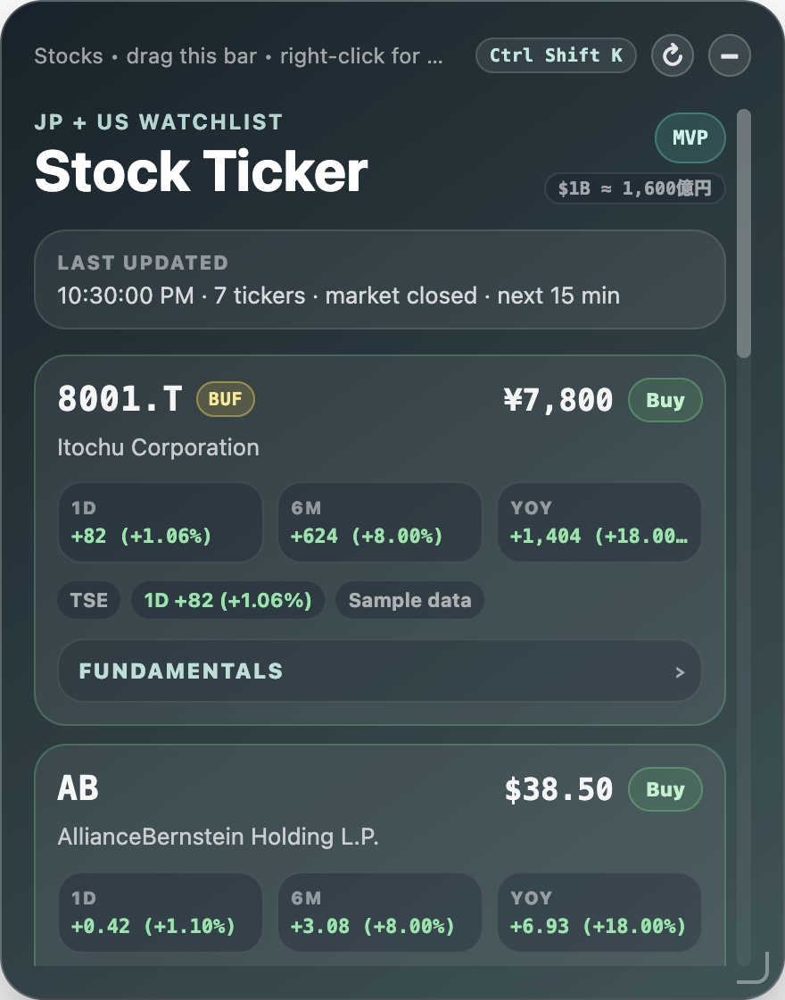

# Stock Ticker Electron Widget

A small frameless Electron widget that shows seeded JP and US stock tickers, names, and prices.

## Preview



## Run

```sh
npm install
npm start
```

## Seeded stocks

- `8001.T` — Itochu Corporation
- `AB` — AllianceBernstein Holding L.P.
- `AXP` — American Express Company
- `NVDA` — NVIDIA Corporation
- `GOOGL` — Alphabet Inc. (Google)
- `8766.T` — Tokio Marine Holdings, Inc.
- `6098.T` — Recruit Holdings Co., Ltd.
- `285A.T` — キオクシア / Kioxia Holdings Corp.
- `7011.T` — Mitsubishi Heavy Industries, Ltd. (MHI)
- `5803.T` — フジクラ / Fujikura Ltd.
- `6857.T` — アドテスト / Advantest Corp.

Prices and 1D / 6M / YoY changes are fetched from Yahoo Finance's public chart endpoint when the widget loads and when you click refresh. Japanese tickers also show a PTS price from Kabutan / Japannext when available. The widget auto-refreshes every minute while any watched market is open, and polls every 15 minutes while markets are closed so it resumes daily. Each row also has a collapsible fundamentals panel with latest-quarter or latest-fiscal-year, trailing-12-month, and balance-sheet metrics from Yahoo Finance fundamentals. If a quote cannot be fetched, the row stays visible with a fallback seeded value.

Use each row's `Buy` button to save a practice-buy rationale to local storage. Saved reasons show up in that ticker's practice log and in the modal the next time you consider buying it. Practice buys can be deleted from either view.

`BUF` marks seeded stocks that Warren Buffett / Berkshire Hathaway has bought in the past. In this initial list, `GOOGL` and `8766.T` are tagged.

## Controls

- Drag the top bar to move the expanded widget.
- Drag stock cards vertically to reorder the watchlist.
- Drag the right, bottom, or bottom-right edge to resize.
- Click `↻` to refresh prices.
- Click `−` or press `Ctrl Shift K` to shrink.
- Drag the compact circle to move it, or click it to expand again.
